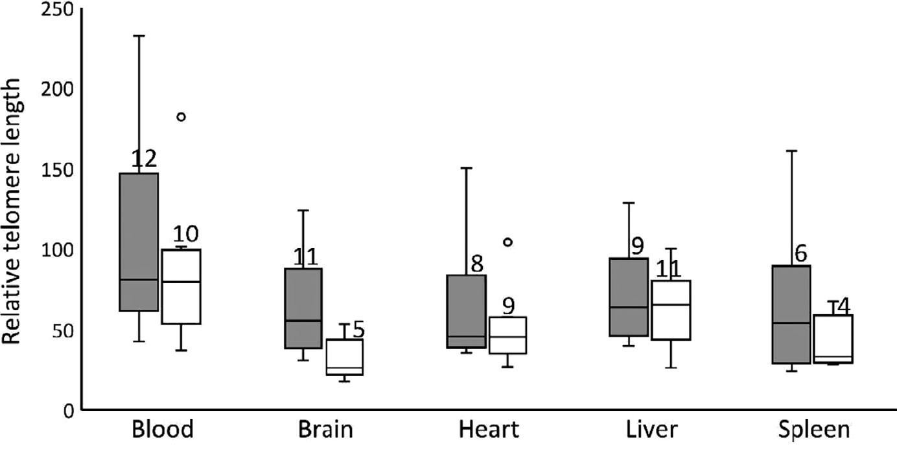

```{r setup, include=FALSE}
knitr::opts_chunk$set(echo = TRUE)
```

# Replication Analysis of **Sex- And tissue-specific differences in telomere length in a reptile**

<br>

#### *Miguel Rubio García*

#### *December 10, 2021*


<br>
        
### **Introduction:**

##### In this analysis, I will be replicating the obtained data from Rollings et al. (2019) which studies the differences on the length of telomeres from different organs and tissues in painted dragon lizards (*Ctenophorus pictus*).
##### Telomeres are long repeated sequences of 6 nucleotides (TTAGGG) at both ends of chromosomes. It is important to know that at the end of every DNA replication cycle, before cellual division, the last portion of the DNA is lost due to how the DNA replication mechanism and DNA polimerases work to copy the DNA. The main purpose of these structures is **protecting the cell DNA** where the useful information is coded and as a result the cell can mantein a complete genetic material.

<br>

##### Traditionally, DNA samples to study and/or identify telomeres' length are obteined from blood because it is the less invading method for the organism among some other advantages and sometimes, results from this telomeric DNA is extended generally to every tissue. However, the authors from this article suggest that this practise might not be accurate because different organs have unique propierties and nonidentical methabolic rates which can affect to telomeres' length. This hypothesis led them to measure telomeres' length in several tissues from this reptile to make a comparision and determine if there are significant differences among them and also if sex may have an effect on this possible distinct lengths.
##### To do so, they obteined and measure telomeres from 5 different organs or tissues: **blood**, **brain**, **heart**, **liver** and **spleen** and quantified its length performing a quantitative PCR aka q-PCR. In order to make comparisions between the different organs and individuals, the ribosomal 18S gene was utilized as a reference because its length is invariant (92 nucleotide amplicon). The relation between the telomeres length and the 18S gene is shown in the data set as "*organ name*RelTel" for the 5 analyzed organs.

<br>

##### In this analysis I will try to replicate some of the statistical test the authors perform to detect differences and correlation between the telomere length and between experimental conditions during incubation and several features from the newborn animals. This includes the mean and standard error of the mean of the RLT from every organ, Pearson's correlation and p-value and plotting some of the analysis to make visual comparision. However, I could not replicate the mixed lineal model to study if there were significant differences in some parts of the analysis.

<br>

### **Preparing the data**

```{r}
library(readxl) #Reads excell data
library(sciplot) #Contains "se()" function to calculate sample standard errors
library(ggplot2) #Used to create ggplots
library(gridExtra) #Package that allows drawing multiple ggplot plots
library(reshape2) #Used to melt values and plot variables simultaneously

```

```{r}
f <- "C:/Users/MIGUEL/Desktop/R/directory1/REPLICATION/reptile_data.xlsx"
data <- read_excel(f, sheet = 1, col_names = TRUE)
d <- na.omit(data)
head(d)
attach(d)
```

<br>

##### First thing I had to do was changing the data set. In the original excell file ("*original data*"), the missing values were labled as ".". This was a problem because when I tried to do the analysis, even though I applied the "na.omit" function, I obteined a NA result. I manually changed every "." in the excell field to "NA" in order to make R understand that that was a missing value and then apply the "na.omit" function ("*reptile_data*" which is the one I used for the analysis). However, I still was getting the following error "*argument is not numeric or logical: returning NA*". Finally, it turned out that some numeric data from the file was being considered as non-numeric vectors.

##### Using the "is.numeric()" function I checked which columns were not being considered numeric and I reached the conclusion that every column that contained a "NA" (that used to be a "." in the original file) was nos being considered numeric. However, if the NAs are changed by a "0", the column is considered as numeric.
<br>

#### **Test:**

```{r}
#"is.numeric()" function tests if an object is numeric (TRUE) or if it is not (FALSE).

is.numeric(BloodRelTel) #Column that has NAs

is.numeric(`Egg mass at laying`) #Column that lacks NAs

is.numeric(`TL at death`) #Column that only has one NA

is.numeric(`SVL at death`) #Another column that lacks NA

is.numeric(BloodRelTel_Telb_run_no) #Column with NAs that were changed to "0"

```

<br>

##### I did not want to change the "NA" values to "0" because it may disrupt future analysis. As a consequence, to be able to use the data from the 5 "*organ name*RelTel" columns, I created 5 new variables called after the organ in which the measurement was performed while making use of the "na.omit" function to get rid of the missing values and the "as.numeric" function to make sure values were logical. Only by applying these 2 functions I could use the objects.

<br>

```{r}
blood <- na.omit(as.numeric(d$BloodRelTel))
heart <- na.omit(as.numeric(d$HeartRelTel))
liver <- na.omit(as.numeric(d$LiverRelTel))
brain <- na.omit(as.numeric(d$BrainRelTel))
spleen <- na.omit(as.numeric(d$SpleenRelTel))
```

<br>

##### I also created 5 other vectors for the RTL of the 5 organs applying the "as.numeric()" function but not the "omit.na()" that I will use in future analysis to avoid errors.

<br>

```{r}
blood2 <- as.numeric(BloodRelTel)
heart2 <- as.numeric(HeartRelTel)
liver2 <- as.numeric(LiverRelTel)
brain2 <- as.numeric(BrainRelTel)
spleen2 <- as.numeric(SpleenRelTel)

#Vectors with the values converted into numeric but mantaining the NAs.
```

<br>

##### The warining message "NAs introduced by coercion"is just R alerting the fact that some values in the original vector were converted to NAs because they couldn’t be converted to numeric values. This values are the manually changed "NAs" described above.

<br>

```{r}
blood
heart
liver
brain
spleen #Resulting vectors
```

<br>

### **Effects on Incubation temperature:**
##### They checked the effect of temperature during incubation on the RTL using a mixed model analysis. However, althought it is indicated that they have used 78 RTL values for this analysis, I do not know which ones have been used (from which organs) or how to apply the mixed model without that information.

<br>

##### Before studying the telomeres, they wanted to see if there is correlation and how it is between the temperature and some other factor like the incubation time, hatching mass or hatching SVL using Pearson's correlation. The SVL is an animal type of body measurement from the tip of the nose of the animal to the cloaca at the tail. Probably they are doing so to have a general background of the effects of these conditions before analyzing the telomeres from the organs. Calculation of the correlation (R) and associated p-value:

<br>

```{r}
cor(Temperature, `Days of incubation`)
m <- lm(Temperature ~ `Days of incubation`)

t <- coef(summary(m))
t <- data.frame(unlist(t))
colnames(t) <- c("Est", "SE", "t-value", "p-value")
t$`p-value`[2]
```

```{r}
cor(Temperature, `Mass at hatching`)
m2 <- lm(Temperature ~ `Mass at hatching`)

t2 <- coef(summary(m2))
t2 <- data.frame(unlist(t2))
colnames(t2) <- c("Est", "SE", "t-value", "p-value")
t2$`p-value`[2]
```

```{r}
cor(Temperature, `SVL at hatching`)
m3 <- lm(Temperature ~ `SVL at hatching`)

t3 <- coef(summary(m3))
t3 <- data.frame(unlist(t3))
colnames(t3) <- c("Est", "SE", "t-value", "p-value")
t3$`p-value`[2]
```


<br>

#### Table summarizing the results:

```{r}
tab <- matrix(c(-0.80387, -0.55184, -0.35869, 2.22e-06, 0.00517, 0.0852), ncol=2, byrow = FALSE)
colnames(tab) <- c("Correlation", "p-value")
rownames(tab) <- c("Temp. ~ Incub.", "Temp. ~ hatch.mass", "Temp. ~ hatch.SVL")
tab <- as.table(tab)

tab
```

<br>

##### Taking a look to the correlation coefficient values (R), we can see that there is a negative correlation between the temperature during incubation and the incubation time (R is close to -1). We might also consider there is a correlation between temperature and hatching mass, although is not as clear as the previous one. There is no correlation between temperature and the hatching SVL (R is close to 0)


<br>

### **Means and standard errors:**

##### The relative telomere length (RTL) was measured in each organ from the individual and the mean and standard error of the mean from the reptile's population was calculated:

<br>

```{r}
mean(blood)
se(blood)

mean(heart) 
se(heart)

mean(liver) 
se(liver)

mean(brain) 
se(brain)

mean(spleen) 
se(spleen)
```

<br>

##### Except from the blood, in the other 4 organ's calculation of the mean the authors have discard one or more values and that is why the results are slightly different from the ones on the article. For example, in the case of the heart they removed the value "150,49", probably because they considered it as an outlayer for being too different to the other values. The standard errors of the mean are the same.

<br>

#### Table summarizing the results:

```{r}
tab2 <- matrix(c(mean(blood), mean(heart), mean(liver), mean(brain), mean(spleen), 95.41, 50.65, 63.77, 47.90, 43.69), ncol=2, byrow = FALSE)
colnames(tab2) <- c("Calculated mean", "Article mean")
rownames(tab2) <- c("Blood.", "Heart", "Liver", "Brain", "Spleen")
tab2 <- as.table(tab2)

tab2
```

<br>


### **Comparision among organ types:**
##### They performed some t-test to determine if there are significant differences between the mean of RTL from different organs. In the article they wrote "t73" and I think the "73" represents the degreed of freedom used for the test. However, I have not been able to set the degrees of freedom I want when calculating the "t" using the function "t.test". I think that is the reason why the following results are different from the ones provided in the article:

<br>

```{r}
t.test(log(blood2), log(heart2), data = d)
t.test(log(blood2), log(brain2), data = d)
t.test(log(blood2), log(spleen2), data = d)
t.test(log(liver2), log(brain2), data = d)
```

<br>

##### They also analyze if there are significant correlations between the different organs. I have only calculated the correlation of the blood and the other 4 organs plus one correlation from brain-heart because doing the whole analysis means introducing much coding and too many new variables to the enviroment. At the end there is a summarizing table. Calculation of R and p-value from the RTL:

```{r}
cor1 <- cor(log(blood2), log(brain2), use = "complete.obs")
q <- lm(log(blood2) ~ log(brain2))

z <- coef(summary(q))
z <- data.frame(unlist(z))
colnames(z) <- c("Est", "SE", "t-value", "p-value")
z$`p-value`[2]
```

```{r}
cor2 <- cor(log(blood2), log(heart2), use = "complete.obs")
q2 <- lm(log(blood2) ~ log(heart2))

z2 <- coef(summary(q2))
z2 <- data.frame(unlist(z2))
colnames(z2) <- c("Est", "SE", "t-value", "p-value")
z2$`p-value`[2]
```

```{r}
cor3 <- cor(log(blood2), log(liver2), use = "complete.obs")
q3 <- lm(log(blood2) ~ log(liver2))

z3 <- coef(summary(q3))
z3 <- data.frame(unlist(z3))
colnames(z3) <- c("Est", "SE", "t-value", "p-value")
z3$`p-value`[2]
```

```{r}
cor4 <- cor(log(blood2), log(spleen2), use = "complete.obs")
q4 <- lm(log(blood2) ~ log(spleen2))

z4 <- coef(summary(q4))
z4 <- data.frame(unlist(z4))
colnames(z4) <- c("Est", "SE", "t-value", "p-value")
z4$`p-value`[2]
```

```{r}
cor5 <- cor(log(brain2), log(heart2), use = "complete.obs")
q5 <- lm(log(brain2) ~ log(heart2))

z5 <- coef(summary(q5))
z5 <- data.frame(unlist(z5))
colnames(z5) <- c("Est", "SE", "t-value", "p-value")
z5$`p-value`[2]
```

<br>

#### Table summarizing the results:

```{r}
tab3 <- matrix(c(cor1, cor2, cor3, cor4, cor5, z$`p-value`[2], z2$`p-value`[2], z3$`p-value`[2], z4$`p-value`[2], z5$`p-value`[2]), ncol=2, byrow = FALSE)
colnames(tab3) <- c("Correlation", "p-value")
rownames(tab3) <- c("Blood ~ Brain.", "Blood ~ Heart", "Blood~Liver", "Blood~Spleen", "Brain~Heart")
tab3 <- as.table(tab3)

tab3
```

<br>

#### Replication of some of the graphs that represent the correlation between different organs.

<br>


```{r}
draw1 <- ggplot(aes(y = log(liver2), x = log(blood2)), data = d) + ylim(2.5, 6) + geom_point() + geom_abline() + xlab("ln(Blood RTL)") + ylab("ln(Liver RTL)")

draw2 <- ggplot(aes(y = log(heart2), x = log(brain2)), data = d) + ylim(2.5, 6) + geom_point() + geom_abline() + xlab("ln(Brain RTL)") + ylab("ln(Heart RTL)")

draw3 <- ggplot(aes(y = log(spleen2), x = log(brain2)), data = d) + ylim(2.5, 6) + geom_point() + geom_abline() + xlab("ln(Brain RTL)") + ylab("ln(Spleen RTL)")

draw4 <- ggplot(aes(y = log(liver2), x = log(heart2)), data = d) + ylim(2.5, 6) + geom_point() + geom_abline() + xlab("ln(Heart RTL)") + ylab("ln(Liver RTL)")
```

<br>

<center>
```{r}
grid.arrange(draw1, draw2, draw3, draw4, ncol=2)
```

<br>

#### Four panels from figure 2 of the article:

<br>

<center> 

<br>

### **Boxplot:**

##### In order to see if there are diferences on the relative telmere length between males and females in each organ, the authors set a boxplot in which they show the RTL in the y axis and the organ and sex in the x axix. I was not able to replicate the mixed model analysis either.
##### To replicate this graph (figure 3), I had to create 5 vectors for the RTL of the 5 organs applying the "as.numeric()" function but not the "omit.na()" (done at the begining of the analysis) because if I use the already created vectors I obtain the following error: *"Error: Aesthetics must be either length 1 or the same as the data (24)"*.

<br>
```{r}
blood2 <- as.numeric(BloodRelTel)
heart2 <- as.numeric(HeartRelTel)
liver2 <- as.numeric(LiverRelTel)
brain2 <- as.numeric(BrainRelTel)
spleen2 <- as.numeric(SpleenRelTel)

#Vectors with the values converted into numeric but mantaining the NAs.
```

<br>

##### Next problem is being able to plot all the RTL from every organ by sex at the same time. I created a new data frame that only includes the "Sex" variable from the original data set (which is defined by 2 possible values: "F" for females and "M" for males) and the 5 vectors I have just created. This way I can apply the "melt" function which puts together all the quantitative data from different variables against a qualitative vector (Sex in this case).

<br>
```{r}
df <- data.frame(Sex, blood2, brain2, heart2, liver2, spleen2)
names(df) <- c("Sex", "Blood", "Brain", "Heart", "Liver", "Spleen")
head(df)

length(spleen2)
```

```{r}
data_long <- melt(df) #Using "Sex" as id variables
head(data_long)
```

```{r}
plot <- ggplot(data_long, aes(x = variable, y = value, color = Sex)) + geom_boxplot() + ylab("Relative telomere length") + theme_bw() + theme(axis.title.x = element_blank())

plot
```

```{r, eval=F}
#Explanation of multiple plotting
https://statisticsglobe.com/draw-multiple-boxplots-in-one-graph-in-r
```

<br>

#### Original plot from the article:

<br>

<center> 

<br>

##### As the data points that have been discarted for the plot are not indicated in the article, there are slight differences in the shape of the boxes and the error bars. By the plot it seems that females have a bit longer telomeres than males, although we would need to do the mixed model analysis to confirm this statistically.

<br>


